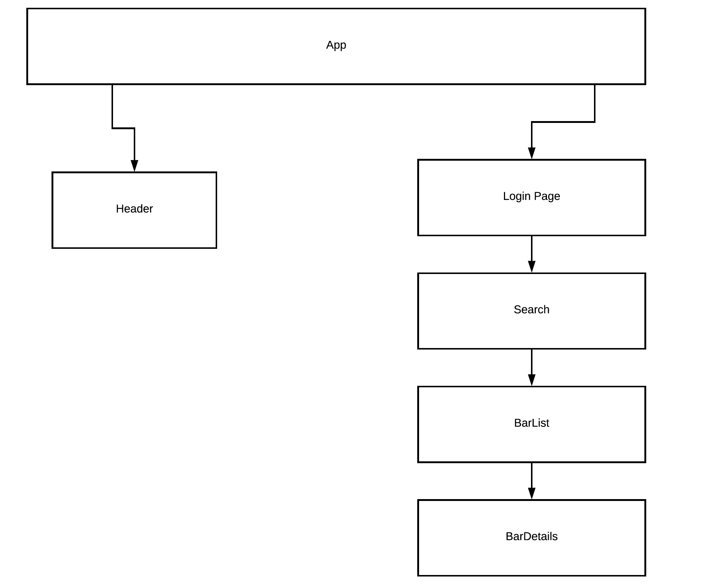

# Bar Hop

#### Bar Hop, Dec 9, 2018

#### By _**Conor McCarthy**_

## Description

_This React Native application allows users to see which bars they can uber to for a predetermined price. The user enters how much money they are willing to spend on an uber and the app return a list of bars_

## Diagram

## Setup/Installation Requirements

- Clone the repository
- Open file in your terminal
- Navigate to the file in your terminal and enter \$ npm install
- If React Native is installed on your machine enter '\$ react-native run-ios'
- If you need to install React Native, please follow the steps below
  - brew install node
  - brew install watchman
  - npm install -g react-native-cli
  - Download Xcode from the app store
  - Navigate to BarHop's folder react-native run-ios

## Known Bugs

_None._

## Support and contact details

- connormaccarthy8@gmail.com\_
- visit React's documentation at `https://reactjs.org/`

## Technologies Used

- JavaScript
- NPM
- React-Native
- GitHub

## Unforseen Issues

### License

Copyright (c) 2018 **_Connor McCarthy_**
